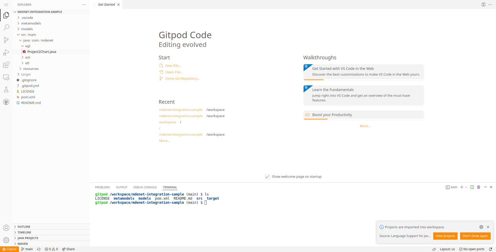
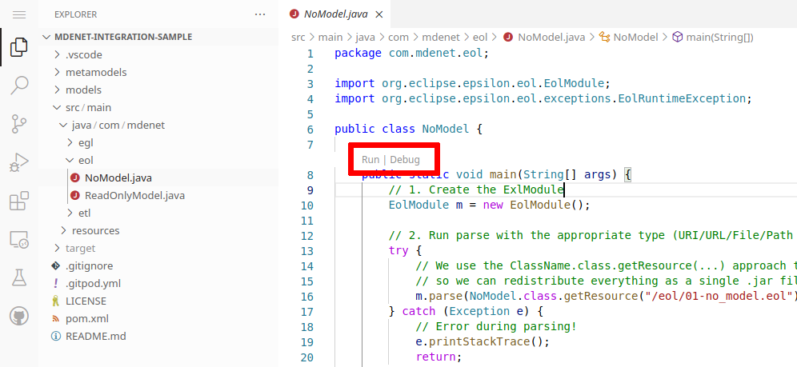
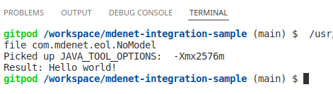
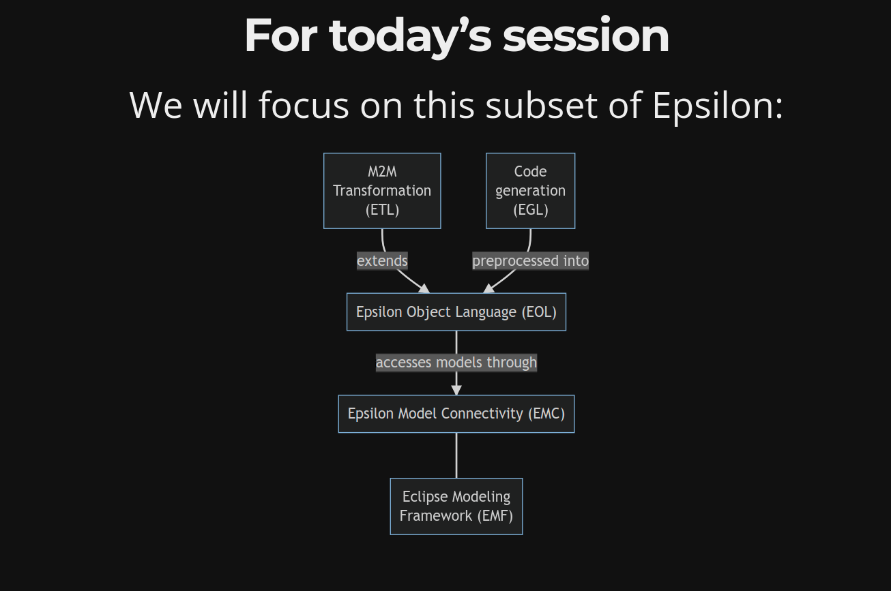

# Introduction

## Who am I?

* Lecturer in Computer Science at Aston University
* Committer in [Eclipse Epsilon](https://eclipse.org/epsilon) since 2011
* Used Epsilon for several approaches:
  * Test design and generation
  * Process-oriented website generation
  * Self-adaptive system introspection
  * Timetable optimisation and export/import

## Session outline

1. Review of main concepts from last session
1. Query and modify models with `EolModule`
1. Transform models with `EtlModule`
1. Generate text with `EglTemplateFactoryModuleAdapter`
1. (Optional) Extend Epsilon with our own Java code

## Review on modeling concepts

* MDE is about using *models* to develop our system: partial descriptions for a certain purpose
* A model is written in a *modeling language*, with formal syntax:
  * Abstract syntax: the concepts (e.g. `Class`)
  * Concrete syntax: the notation (e.g. textual/graphical)
* Modeling languages may be "general purpose" (e.g. UML) or domain-specific

## Review on Eclipse Epsilon {.diagram-slide}

<div>
<span class="diagram-data" style="display: none;">
graph TD
    ECL["Model&lt;br/&gt;comparison&lt;br/&gt;(ECL)"]
    Flock["Model&lt;br/&gt;migration&lt;br/&gt;(Flock)"]
    EGL["Code&lt;br/&gt;generation&lt;br/&gt;(EGL)"]
    EVL["Model&lt;br/&gt;validation&lt;br/&gt;(EVL)"]
    EPL["Pattern&lt;br/&gt;Matching&lt;br/&gt;(EPL)"]
    EML["Model&lt;br/&gt;Merging&lt;br/&gt;(EML)"]
    ETL["M2M&lt;br/&gt;Transformation&lt;br/&gt;(ETL)"]
    EOL["Epsilon Object Language (EOL)"]
    ETL --&gt; |extends|EOL
    EML --&gt; |uses for matching|ECL
    EML --&gt; |extends|ETL
    EPL --&gt; |extends|EOL
    ECL --&gt; |extends|EOL
    EGL --&gt; |preprocessed into|EOL
    EVL --&gt; |extends|EOL
    Flock --&gt; |extends|EOL
    Pinset --&gt; |extends|EOL

    EMC["Epsilon Model Connectivity (EMC)"]
    EMF["Eclipse Modeling&lt;br/&gt; Framework (EMF)"]
    Simulink["MATLAB&lt;br/&gt;Simulink"]
    Excel["Excel&lt;br/&gt;Speadsheets"]
    PTC["PTC Integrity&lt;br/&gt;Modeller"]
    Dots["..."]

    EOL --&gt;|accesses models through| EMC
    EMC --- EMF
    EMC --- Simulink
    EMC --- XML
    EMC --- Excel
    EMC --- PTC
    EMC --- CSV
    EMC --- Dots
</span>
<div class="diagram-display" style="min-height: 700px;"></div>
</div>

## For today's session {.diagram-slide}

We will focus on this subset of Epsilon:

<div>
<span class="diagram-data" style="display: none;">
graph TD
    EGL["Code&lt;br/&gt;generation&lt;br/&gt;(EGL)"]
    ETL["M2M&lt;br/&gt;Transformation&lt;br/&gt;(ETL)"]
    EOL["Epsilon Object Language (EOL)"]
    ETL --&gt; |extends|EOL
    EGL --&gt; |preprocessed into|EOL

    EMC["Epsilon Model Connectivity (EMC)"]
    EMF["Eclipse Modeling&lt;br/&gt; Framework (EMF)"]

    EOL --&gt;|accesses models through| EMC
    EMC --- EMF
</span>
<div class="diagram-display" style="min-height: 700px;"></div>
</div>

## Environment setup with Gitpod.io

* In the previous session, we used the [Epsilon Playground](https://www.eclipse.org/epsilon/live/) to introduce Epsilon
* This session will focus on invoking E\*L scripts from Java code, using the Maven artifacts available from [Maven Central](https://search.maven.org/search?q=g:org.eclipse.epsilon)
* Epsilon can also be used from the Eclipse IDE, or from its Ant/Maven/Gradle tasks
* To avoid having to set up an IDE, we will use Gitpod.io: open [this link](https://gitpod.io/#https://github.com/bluezio/mdenet-integration-sample) and authenticate via GitHub.

## Gitpod.io: authentication


## Gitpod.io: main page



## Gitpod.io: first-time check

{ width=80% }

* Press Ctrl+P, type `NoModel` and press Enter
* If you do not see "Run | Debug", reload the page

# Querying models with EOL from Java

## Project structure

* Standard Maven-based project (with a `pom.xml`)
* We use Java 11 sources, building for Java 11+
* We are using Epsilon 2.4.0 interims (`-SNAPSHOT`), to avoid a warning message when using EGL
* We use `<dependencyManagement>` to ensure we use modern Eclipse core JARs:
  * The Eclipse JARs in Maven Central use version range dependencies (mimicking Eclipse plugin semantics)
  * These range-based dependencies can sometimes result in mismatched code signing certificates

## Maven dependency: EOL

```xml
<dependency>
  <groupId>org.eclipse.epsilon</groupId>
  <artifactId>org.eclipse.epsilon.eol.engine</artifactId>
  <version>${epsilon.version}</version>
</dependency>
```

* Stable Epsilon JARs available from [Maven Central](https://search.maven.org/search?q=g:org.eclipse.epsilon)
* Interim Epsilon JARs available from [Sonatype](https://oss.sonatype.org/#nexus-search;gav~org.eclipse.epsilon~~~~)
* Artifact ID points to the EOL execution engine
* Maven `epsilon.version` property ensures the Epsilon JARs match each other

## EOL without a model (1/2)

* Enter Ctrl+P and open `NoModel.java`
* You will notice it follows three large steps:
  1. Create a new `EolModule`
  1. Call `.parse()` while passing the reference to the script location: in this case, we package the script with our application, but it could be an external file
  1. Run `.execute()` to obtain the result (in case the last statement is a `return`)
* Try clicking on "Run" above `public static void main`, and watch the terminal

## EOL without a model (2/2)



* No big surprises here :-)
* Ignore the `Picked up` part: it's Gitpod-specific
* Obviously, we want to work on models: let's do that next!

## EOL with a read-only model

* Enter Ctrl + P and open `ReadOnlyModel.java`
* There are quite a few more steps here:
  1. Configure EMF to support [Flexmi](https://www.eclipse.org/epsilon/doc/flexmi) / [Emfatic](https://www.eclipse.org/emfatic/) models
  1. Parse the EOL code (same as before)
  1. Set up an `EmfModel` and add it to the *model repository* of the `EolModule`
  1. Run the EOL script
  1. Dispose all models in the model repository

## What is EmfModel?

* `EmfModel` is an implementation of the [EMC](https://www.eclipse.org/epsilon/doc/emc/) `IModel` interface
* It allows Epsilon to use [EMF](https://www.eclipse.org/modeling/emf/)-based models
* Epsilon is otherwise independent from EMF: if you want to support a non-EMF model format, just provide your own `IModel` implementation

## New dependency: EMF EMC driver

```xml
<dependency>
  <groupId>org.eclipse.epsilon</groupId>
  <artifactId>org.eclipse.epsilon.emc.emf</artifactId>
  <version>${epsilon.version}</version>
</dependency>
```

* This Maven artifact provides `EmfModel`
* By default, EMF only supports the XMI/XML model format

## New dependency: Flexmi

```xml
<dependency>
  <groupId>org.eclipse.epsilon</groupId>
  <artifactId>org.eclipse.epsilon.flexmi</artifactId>
  <version>${epsilon.version}</version>
</dependency>
```

* Allows Epsilon to read Flexmi models

## New dependency: Emfatic

```xml
<dependency>
  <groupId>org.eclipse.emfatic</groupId>
  <artifactId>org.eclipse.emfatic.core</artifactId>
  <version>1.0.0</version>
</dependency>
```

* Allows Epsilon to read EMF metamodels in the Emfatic language

## Telling EMF about Flexmi and Emfatic

```java
final var emap = Resource.Factory.Registry.INSTANCE.getExtensionToFactoryMap();
emap.put("flexmi", new FlexmiResourceFactory());
emap.put("emf", new EmfaticResourceFactory());
```

* EMF can be told which parser (resource factory) to use based on the file extension
* In the above code, we are accessing the global registry and registering the `.flexmi` and `.emf` file extensions (on top of the default `.xmi` one)

## How do you use EmfModel?

1. Specify the metamodel with your modeling language's concepts (here, it's a file path)
1. Specify the location of the model (also a file path)
1. Decide if the specified location should be read when the model is loaded:
   * `true` iff model is an input to the current task
1. Decide if the model should be saved back when the model is disposed:
   * `true` iff model is an output of the current task
1. Trigger the load with `m.load()`
1. Add it to the model repository of the module

## Disposing of models

* Since Java is garbage collected, simply having the `EolModule` variable go out of scope is not enough to free its resources (as in C++)
* Always remember to `dispose()` the model repository once a model is done running:
  1. Allows models to be GC'ed if no longer referenced
  1. Saves the models with `setStoredOnDisposal(true)`

## Test and tweak ReadOnlyModel

Running `ReadOnlyModel` will produce the same output as in the Playground:


* Instead of printing a value, change the last statement to a `return`
* Change your Java code to print the result

## WriteModel: adding a task (1/3)

* Now, create a copy of `ReadOnlyModel` called `WriteModel` that:
  * Runs `03-add_task.eol` instead
  * Loads and saves `models/project.flexmi.xmi`
    * Note: saving is a no-op in Flexmi, hence we use XMI
* Try running the class again: what happened?

## WriteModel: adding a task (2/3)


* The "diff" tells us a new task was added
* Duration is 10: the default value in the EOL code
* In a real application, our Java code may want to pass variables to the EOL script

## WriteModel: adding a task (3/3)

```java
eol.getContext().getFrameStack()
   .put(Variable.createReadOnlyVariable("duration", 42));
```

* Add the above code before the `.execute()` call, importing `execute.context.Variable`
* Rerun `WriteModel`: you should see a new task with the specified duration
* Epsilon organises variables into a stack of *frames*, with a frame for global variables, and additional frames for each nested operation call

# Transforming models with ETL from Java

## Code walkthrough

* Enter Ctrl + P and open `Tree2Graph.java`
* Uses ETL to transform a tree to a graph
* It follows similar steps as for EOL:
  1. Register the Flexmi/Emfatic parsers into EMF
  1. Parse the ETL script
  1. Create a source `EmfModel`
  1. Create a target `EmfModel`
  1. Execute the transformation
  1. Dispose of the models

## Model names and read/stored flags

```java
// Allows using Source!Tree to refer to the type
source.setName("Source");
// We only read from this model
source.setReadOnLoad(true);
source.setStoredOnDisposal(false);

// Allows using Target!Graph
target.setName("Target");
// We only write to this model
target.setReadOnLoad(false);
target.setStoredOnDisposal(true);
```

## Notes about model repositories

* A model repository can have as many models as we like, and we can mix EMF and non-EMF ones
* ETL can transform one source element to one or more target elements
* ETL can work with multiple input models

## Obtaining traceability from ETL (1/4)

* Run `Tree2Graph`, and open `models/graph.xmi`
* We have a graph, but where did each node come from? We need *traceability* information!
* Add this after `etl.execute()` inside the `try`:

```java
for (Transformation tx : etl.getContext().getTransformationTrace().getTransformations()) {
  System.out.println(tx.getSource() + " produced " + tx.getTargets());
}
```

## Obtaining traceability from ETL (2/4)

Run `Tree2Graph` and you will get a list like this:

```
org.eclipse.emf.ecore.impl.DynamicEObjectImpl@576f63f6 (eClass: org.eclipse.emf.ecore.impl.EClassImpl@3403e2ac (name: Tree) (instanceClassName: null) (abstract: false, interface: false)) produced [org.eclipse.emf.ecore.impl.DynamicEObjectImpl@13e547a9 (eClass: org.eclipse.emf.ecore.impl.EClassImpl@40844aab (name: Graph) (instanceClassName: null) (abstract: false, interface: false))]
org.eclipse.emf.ecore.impl.DynamicEObjectImpl@2dca0d64 (eClass: org.eclipse.emf.ecore.impl.EClassImpl@3403e2ac (name: Tree) (instanceClassName: null) (abstract: false, interface: false)) produced [org.eclipse.emf.ecore.impl.DynamicEObjectImpl@3fb6cf60 (eClass: org.eclipse.emf.ecore.impl.EClassImpl@447a020 (name: Node) (instanceClassName: null) (abstract: false, interface: false))]
org.eclipse.emf.ecore.impl.DynamicEObjectImpl@5ef6ae06 (eClass: org.eclipse.emf.ecore.impl.EClassImpl@3403e2ac (name: Tree) (instanceClassName: null) (abstract: false, interface: false)) produced [org.eclipse.emf.ecore.impl.DynamicEObjectImpl@37ddb69a (eClass: org.eclipse.emf.ecore.impl.EClassImpl@447a020 (name: Node) (instanceClassName: null) (abstract: false, interface: false))]
org.eclipse.emf.ecore.impl.DynamicEObjectImpl@55dfebeb (eClass: org.eclipse.emf.ecore.impl.EClassImpl@3403e2ac (name: Tree) (instanceClassName: null) (abstract: false, interface: false)) produced [org.eclipse.emf.ecore.impl.DynamicEObjectImpl@349c1daf (eClass: org.eclipse.emf.ecore.impl.EClassImpl@447a020 (name: Node) (instanceClassName: null) (abstract: false, interface: false))]
```

Not particularly nice to look at...

## Obtaining traceability from ETL (3/4)

Change the code to this:

```java
for (Transformation tx : etl.getContext().getTransformationTrace().getTransformations()) {
    EObject eob = (EObject) tx.getSource();
    EStructuralFeature sfLabel = eob.eClass().getEStructuralFeature("label");
    String label = (String) eob.eGet(sfLabel);

    for (Object txTarget : tx.getTargets()) {
        EObject eobTarget = (EObject) txTarget;
        EStructuralFeature sfName = eobTarget.eClass().getEStructuralFeature("name");
        String name = (String) eobTarget.eGet(sfName);
        System.out.println("Tree " + label + " produced Node " + name);
    }
}
```


## Obtaining traceability from ETL (4/4)

* New code is a bit cumbersome due to the use of a *dynamic* metamodel, loaded from a file rather than implemented in code (generated by EMF)
* Dynamic metamodels require using EMF's generic `EObject` type
* Run the new version to see the mappings:

```
Tree t1 produced Node t1
Tree t2 produced Node t2
Tree t3 produced Node t3
Tree t4 produced Node t4
```

# Generating text with EGL from Java

## Code walkthrough

* Enter Ctrl + P and open `Project2Chart.java`
* The steps should be quite familiar:
  1. Register the Flexmi/Emfatic parsers into EMF
  1. Parse the EGL script
  1. Create a source `EmfModel`
  1. Execute the script
  1. Dispose of the models
* Run it to obtain the `output.html` file

## EGL module adapter

* Internally, EGL works by generating an EOL file from your EGL script
* `EglTemplateFactoryModuleAdapter` is an adapter over EGL's internal APIs that can be used in the same way as the `ExlModule` classes of the other Epsilon languages

## Previewing the output

* Open the `output.html` file in the root folder
* Click the "Live Preview" button at the top right:


* You should be able to preview it as a webpage:


# Conclusion

## Session recap { .overview }




## Thank you!

Antonio Garcia-Dominguez

a.garcia-dominguez AT aston.ac.uk

[\@antoniogado](http://twitter.com/antoniogado)

## Further discussion topics

* [Calling Java from Epsilon](https://www.eclipse.org/epsilon/doc/articles/call-java-from-epsilon/)
* [Calling native lambda expressions](https://www.eclipse.org/epsilon/doc/articles/lambda-expressions/)
* [Developing a new EMC driver](https://www.eclipse.org/epsilon/doc/articles/developing-a-new-emc-driver/)
* [Instrumenting Epsilon programs](https://www.eclipse.org/epsilon/doc/articles/monitoring-and-instrumenting-epsilon-programs/)
